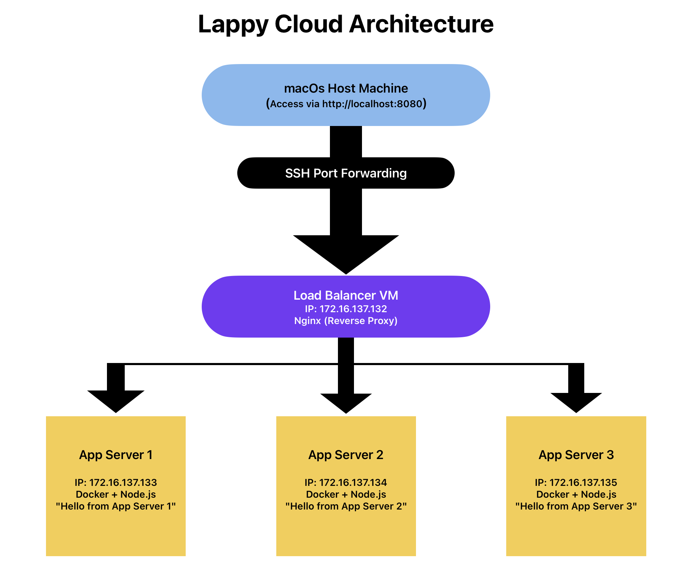

# 🌩️ Cloud Infrastructure on Fedora : Virtualization, Containers & Load Balancing

---

## 🧾 Overview

This project demonstrates how to build a **complete mini cloud infrastructure** from scratch using **Fedora VMs on VMware Fusion**, combining the power of **virtualization**, **networking**, **containerization**, and **load balancing**.

You’ll deploy:
- 🖥️ **3 Application Servers** (Dockerized Node.js apps)
- 🌐 **1 Load Balancer Server** (Nginx reverse proxy using round-robin)
- 💻 **macOS host** (Access via SSH port forwarding)

---

## 🧱 Architecture

